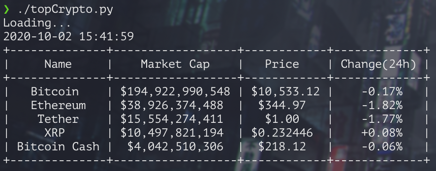
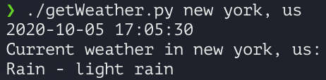

# Automatetheboringstuff
Python scripts for automating tasks based on Automate The Boring Stuff

**Examples:**

*topCrypto.py*

Scrapes top 5 cryptocurrencies by market cap from CoinMarketCap.com and presents data in PrettyTable format

*getWeather.py*

Prints out weather information for specified U.S. city

